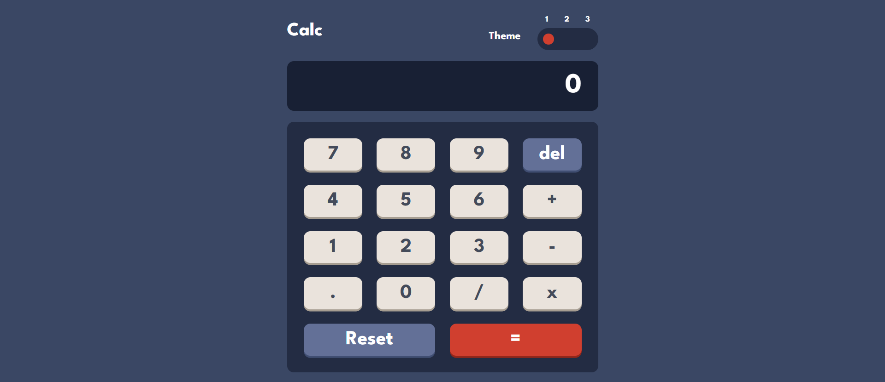
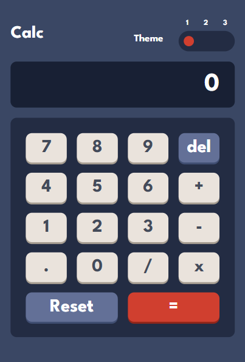

# Frontend Mentor - Calculator app solution

This is a solution to the [Calculator app challenge on Frontend Mentor](https://www.frontendmentor.io/challenges/calculator-app-9lteq5N29). Frontend Mentor challenges help you improve your coding skills by building realistic projects. 

## Table of contents

- [Overview](#overview)
  - [The challenge](#the-challenge)
  - [Screenshot](#screenshot)
  - [Links](#links)
- [My process](#my-process)
  - [Built with](#built-with)
  - [What I learned](#what-i-learned)
  - [Continued development](#continued-development)
  - [Useful resources](#useful-resources)
- [Author](#author)


## Overview

### The challenge

Users should be able to:

- See the size of the elements adjust based on their device's screen size
- Perform mathmatical operations like addition, subtraction, multiplication, and division
- Adjust the color theme based on their preference
- **Bonus**: Have their initial theme preference checked using `prefers-color-scheme` and have any additional changes saved in the browser

### Screenshot





### Links

- Solution URL: [Add solution URL here](https://your-solution-url.com)
- Live Site URL: [Add live site URL here](https://your-live-site-url.com)

## My process

### Built with

- Semantic HTML5 markup
- CSS custom properties
- Flexbox
- CSS Grid
- Mobile-first workflow


### What I learned

```html 
<div class="calc-screen" aria-live="polite"> 
    0
</div>
```
I learned about this nice aria attribute, which in this case reads the contents of the calculator-screen element as soon as it changes. This way it will be easier for users to follow the written expression.


```css
.calc-keypad {
    display: grid;
    grid-template-columns: repeat(4, minmax(3.5rem, 1fr));
    gap: clamp(1rem, 2vw, 1.3rem);

    /* background-color: var(--bg-keypad);
    padding: var(--_block-padding);
    border-radius: var(--_block-border-radius);

    font-size: var(--fs-400); */
}
```
Using CSS Grid, I was able to make the keys on the keypad shrink and grow according to the screen size.


```js
expression = eval(expression || "0").toString();
```
The eval function executes the contents of given string type argument as JS code. Therefore, its use may be dangerous for the security of the page data. However, in this case, the user inputs through the created buttons only with mathematical values. So I think it can be used with some control or just for learning purposes.


```js
expression = expression.slice(0, -1);
```
I also learned more about the slice method for strings (there is a similar method for arrays). The first argument is the start index from which we "slice" a piece of string, and the second argument is the end index. The string slice from this position will NOT be included in the slice.
This is the method I used to "remove" the last character from the string. You might as well replace the last character in a string by adding the desired character to the end of the new slice.


### Continued development

Implementing these 3 page themes has been a bit of a challenge. My solution works using CSS variables with no noticeable problems, but I was wondering if it could be done in a simpler or more oganized way?


### Useful resources

- [MDN](https://developer.mozilla.org/en-US/docs/Web/JavaScript/Reference/Global_Objects/eval) - About eval()


## Author

- Frontend Mentor - [@DaniilGurski](https://www.frontendmentor.io/profile/DaniilGurski)